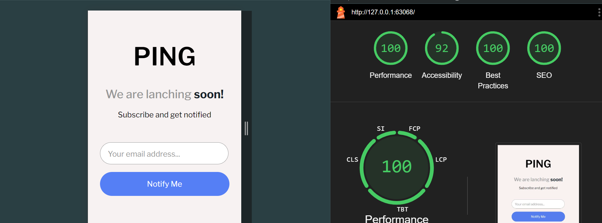

# Master Page

## Table of contents

- [The challenge](#the-challenge)
- [Screenshot](#screenshot)
- [Links](#links)
- [My process](#my-process)
- [Built with](#built-with)
- [What I learned](#what-i-learned)
- [Author](#author)

## The challenge

Users should be able to:

- View the optimal layout for the site depending on their device's screen size
- See hover states for all interactive elements on the page
- Submit their email address using an `input` field
- Receive an error message when the `form` is submitted if:
  - The `input` field is empty. The message for this error should say _"Whoops! It looks like you forgot to add your email"_
  - The email address is not formatted correctly (i.e. a correct email address should have this structure: `name@host.tld`). The message for this error should say _"Please provide a valid email address"_

## Screenshot

[Desktop image](image.png)



## Links

[LIVE:DEMO](https://miron-silviu.github.io/Page-Master/)

## My process

## First Step

I created index.html file and I defined all elements

## Second Step

I Crated normalize.css and style.css files, I linked it to index.html.
In style.css I created @ import rule to import normalize.css . Inside :root pseudo-clss I defined variables for different types of colors and font-family

## Third Step

I the third step I started to style all elements from index.html, according with the design .

## Built with

- Semantic HTML5 markup
- CSS custom properties
- Flexbox
- CSS Grid
- Mobile-first workflow
- [React](https://reactjs.org/) - JS library
- [Next.js](https://nextjs.org/) - React framework
- [Styled Components](https://styled-components.com/) - For styles

## What I learned

To see how you can add code snippets, see below:

```html
<h1>Some HTML code I'm proud of</h1>
```

```css
.proud-of-this-css {
  .facebook,
  .x,
  .instagram {
    min-width: 1rem;
    min-height: 1rem;
    border: 1px solid var(--Gray);
    border-radius: 100%;
    padding: 0.6rem;
  }
}
```

```js
const proudOfThisFunc = () => {
  console.log('🎉');
};
```

If you want more help with writing markdown, we'd recommend checking out [The Markdown Guide](https://www.markdownguide.org/) to learn more.

## Useful resources

- [Example resource 1](https://fontawesome.com/) - This helped me to download the social media icons

## Author

- Website - [Add your name here](https://www.your-site.com)
- Frontend Mentor - [@yourusername](https://www.frontendmentor.io/home)
- Twitter - [@yourusername](https://x.com/silviuumiron)
